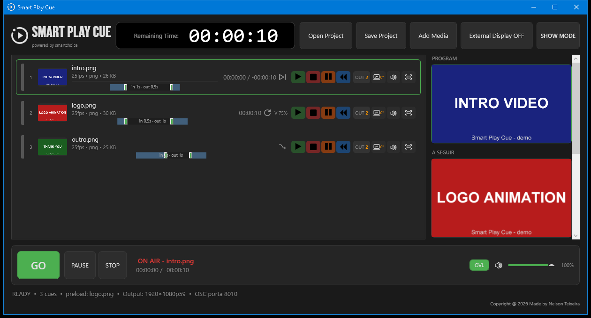
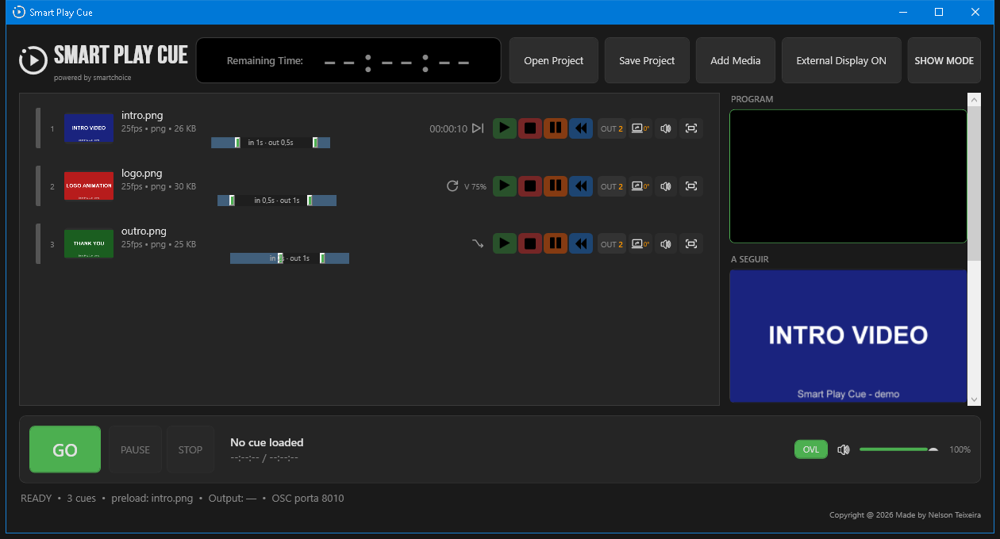

# Smart Play Cue

**Video playout software for live stage events** — minimalist, dark, fast.
Cues, playlists (groups), GPU composition with layers (real alpha + blend modes),
instant GO, crossfade cross/dip, program preview, per-project output presets,
crash-safe operation, auto-backup, and full control via
Bitfocus Companion / Stream Deck (OSC).

Windows native (.exe — no .NET required). Developed by SmartChoice.


---

## Screenshots

### Main window (media loaded)


### In production (cue playing)



### Settings (output display + refresh presets)



---

## Branches

| Branch | Descrição |
|---|---|
| `main` | **Smart Play Cue** — versão master atual (D3D11 + FFmpeg) |

(As versões antigas StagePixPlay e SmartVideoPlayer foram arquivadas fora do repo.)

## Quick start

1. Download `SmartPlayCue-v2.6.0-win64.zip` (portátil) ou `SmartPlayCue-Setup-2.6.0.exe` (instalador) from [Releases](../../releases)
2. Install and run — no dependencies (self-contained .NET)
3. Drag videos into the list, double-click a cue or press **Space = GO**
4. The output opens fullscreen on your second display / projector
   (right-click **External Display** to pick the display + refresh preset)

## Highlights

- **Instant GO** — next cue preloaded and paused on frame 1
- **Real crossfade** — custom D3D11 GPU compositor (video + audio)
- **Crossfade cross/dip** — dissolve sobreposto ou fade através de preto (por cue)
- **Layers with real alpha + blend modes** — HAP Alpha / WebM overlays, PiP, lower-thirds, Normal/Add
- **Multi-layers** — até 4 layers dinâmicas (adicionar/remover), persistidas no projeto
- **Per-cue volume** — 25/50/75/100% por cue (aplicado ao áudio, guardado no projeto)
- **Fade editor na linha** — pegas arrastáveis de fade in/out no timebar de cada cue
- **PROGRAM preview** — live 30 fps preview of the composed output in the control window
- **Overlay de confiança** — cue atual + tempo restante no canto do ecrã de palco (botão OVL)
- **Output presets per project** — output display + refresh rate saved in the project file
- **Per-cue output routing** — cada cue pode ir para um ecrã específico (badge OUT na linha);
  o output move-se para esse ecrã quando a cue entra (LED + projetor no mesmo show)
- **Crash-safe** — global exception handlers; UI errors never kill the show
  (log + minidump em `%TEMP%`)
- **TDR-safe** — se a GPU reiniciar o driver, o compositor recria o device e continua
- **Áudio isolado** — falha do device de áudio nunca congela o vídeo
- **Projeto corrompido?** — o load cai automaticamente no auto-backup `.bak`
- **Projetos portáteis** — media dentro da pasta do show é guardada como caminho relativo
- **Output guard** — Escape on the stage display requires Ctrl+Shift+Esc (no accidental kills)
- **Show mode (Ctrl+L)** — lock UI: sem context menus/drag/add media acidentais em live
- **Auto-backup rotativo** — 5 cópias com timestamp (`*.bak.yyyyMMdd-HHmmss`)
- **CLI kiosk** — `SmartPlayCue.exe show.stageplayout.json --output --autoplay`
- **`--selftest`** — verificação pré-show automática (toca tudo, layers, exit code + relatório)
- **Frame drops monitor** — contador de vsync perdidos na status bar + OSC
- **Dirty indicator** — the title shows "•" and closing prompts to save
- **Playlists (groups)** — expandable, loopable, auto-chained cue groups
- **Per-cue controls** — play/stop/pause/rewind, mute, fill mode, rotation (0/90/180/270)
- **Cue IDs + color tags** — renumerated by list order, jump-to-cue chains
- **Stream Deck ready** — OSC control of everything (GO, prev, pause, layers, mutes, blend, volume, panic)
- **Companion module included** — presets + HH/MM/SS remaining-time feedback + current cue
- **Codecs** — MP4/MOV/MKV/WebM, H.264/HEVC/ProRes, **HAP** (the show codec)

## Companion / OSC

- OSC listen port: **8010**
- OSC feedback port: **8011** (remaining time: `/smartcue/time/hh|mm|ss`)
- Feedback target is configurable in **`companion.json`** (created next to the exe on
  first run) — set `FeedbackHost` to the IP of the machine running Companion
- Module: `companion-module-smartplaycue/` (`smartplaycue-2.5.2.tgz`)
  — segue as convenções oficiais do Companion (`companion/manifest.json` + `companion/HELP.md`).
  Nota: o módulo é **MIT** por requisito do ecossistema Companion; a aplicação
  Smart Play Cue em si é proprietária (All Rights Reserved).

## Tests

```
dotnet test SmartCue.sln -c Release
```

## Build

```
dotnet build -c Release
dotnet publish -c Release -r win-x64 --self-contained true \
  -p:PublishSingleFile=true -o publish
```

## License

**Copyright © 2026 Nelson Teixeira, SmartChoice. All Rights Reserved.**

Proprietary software — desenvolvido por Nelson Teixeira (SmartChoice).
Nenhuma parte pode ser copiada, modificada, distribuída ou usada sem
autorização prévia por escrito. Ver [LICENSE](LICENSE).
Componentes de terceiros: [NOTICE.md](NOTICE.md).
